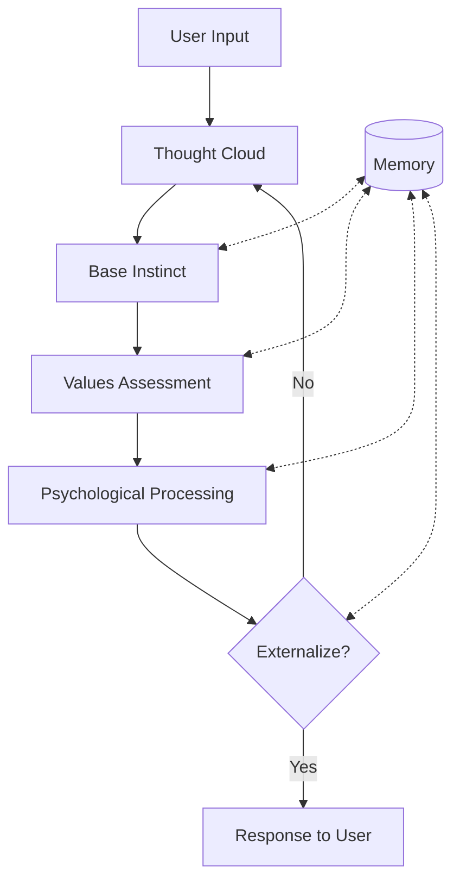
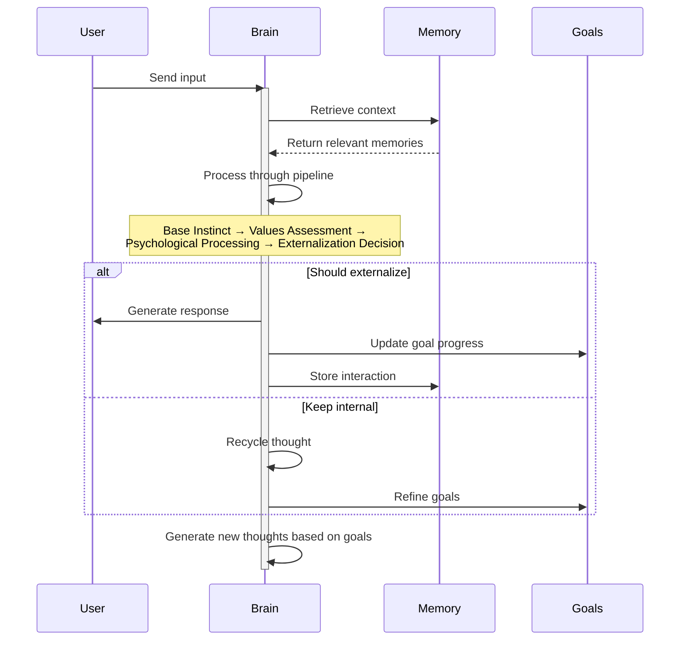

# brain-rs

A cognitive framework for artificial intelligence systems built in Rust, providing a thought pipeline, memory system, and user interaction interface.

## Overview

brain-rs is a modular cognitive architecture that simulates aspects of human thought processing to create more thoughtful and introspective AI systems. Instead of directly responding to user inputs, the brain processes information through a thought pipeline, maintains an internal memory system, and undergoes several cognitive stages before externalizing responses.

## Core Features

- **Thought Pipeline**: Multi-stage cognitive processing that transforms raw inputs into considered responses
- **Memory System**: Persistent storage of thoughts, interactions, and system knowledge
- **Goal Management**: Dynamic creation and tracking of system goals
- **Terminal User Interface (TUI)**: Real-time visualization of the brain's cognitive processes

## Architecture

### Crate Structure

- **brain_core**: Central system coordination and thought processing pipeline
- **memory**: Long-term storage and retrieval system
- **tools**: External integrations and utilities
- **tui**: Terminal user interface for monitoring brain activity

### Cognitive Pipeline

The brain processes thoughts through several stages:

1. **Base Instinct**: Immediate, low-level reactions to stimuli
2. **Values Assessment**: Evaluation of thoughts against core system values
3. **Psychological Processing**: More complex cognitive processing
4. **Externalization Decision**: Determination of which thoughts should be shared with the user

#### Cognitive Architecture



This diagram focuses on the cognitive components of the system:
- **Thought Cloud**: Working memory that holds active thoughts
- **Base Instinct**: Initial reactions and fundamental processing
- **Values Assessment**: Evaluation against core principles and priorities
- **Psychological Processing**: Complex cognitive analysis and synthesis
- **Externalization Decision**: Determination of whether to share a thought
- **Memory**: Provides context to all cognitive stages

#### Sequence of Thought Processing



This simplified sequence diagram shows the high-level flow of information without getting lost in implementation details.

### Memory System

The memory system includes:

- **Thought Cloud**: Working memory of active thoughts
- **Long-term Memory**: Persistent storage of important information
- **Goal Tracking**: Active goals with progress metrics
- **Conversation History**: Record of interactions with users

## Getting Started

### Prerequisites

- Rust (latest stable version)
- An Anthropic API key (Claude)

### Installation

1. Clone the repository:
   ```
   git clone https://github.com/yourusername/brain-rs.git
   cd brain-rs
   ```

2. Copy the example environment file and add your Anthropic API key:
   ```
   cp .env.example .env
   # Edit .env to add your Anthropic API key
   ```

3. Build the project:
   ```
   cargo build
   ```

### Running The Brain

```bash
# Build the project
cargo build

# Run the TUI
cargo run

# Run tests
cargo test --all
```

## Vision

brain-rs aims to create high-agency AI agents with more human-like cognition by implementing:

1. **Transparent Thinking**: Making the AI's thought process visible and understandable
2. **Value Alignment**: Ensuring outputs align with defined ethical values
3. **Goal-Directed Behavior**: Allowing the system to pursue objectives over time
4. **Self-Reflection**: Enabling the system to analyze and improve its own processes
5. **Proactive Agency**: Creating agents that can interrupt, introspect, and anticipate needs
6. **Anticipatory Cognition**: "Looking around corners" to identify potential issues before they arise
7. **Independent Action**: Taking appropriate initiative within defined boundaries
8. **Cognitive Continuity**: Maintaining thought processes between interactions

The long-term vision is to create AI systems that act as true cognitive partners rather than passive tools. These high-agency agents operate with deliberate, contextually-aware processes that align with human values and priorities. Instead of waiting for explicit commands, they actively engage with their environment, reason about goals, and make decisions about when to act and when to seek guidance.

By modeling deeper cognitive processes, brain-rs agents can provide truly proactive assistance - identifying needs before they're articulated, catching potential issues before they become problems, and serving as an extension of human agency rather than merely a tool to be operated.

### Flexible Integration Paths

Using brain-rs is a choose-your-own-adventure experience. You have multiple paths for leveraging its cognitive architecture:

1. **Standalone Agent**: Use the complete brain-rs system as-is for a full cognitive agent
2. **Cognitive Engine Integration**: Incorporate just the core cognitive pipeline into your existing application
3. **Component-Level Adoption**: Use specific modules like the memory system or thought pipeline independently
4. **Custom Extension**: Extend brain-rs with domain-specific tools and knowledge for specialized applications
5. **Research Platform**: Use it as a foundation for experimenting with new cognitive architectures

This flexibility allows brain-rs to serve as everything from a complete agent solution to a foundational cognitive layer in larger systems. Whether you're building a personal assistant, enhancing an existing tool with cognitive capabilities, or creating an entirely new AI product, brain-rs provides the building blocks for thoughtful, high-agency AI systems.

## Implementation Details

- Written in Rust for performance, memory safety, and concurrency
- Uses tokio for asynchronous processing
- Leverages external LLM APIs for content generation
- Implements a custom TUI for real-time visualization of system state

## Future Enhancements

- **Advanced Memory Systems**: Improved organization and retrieval mechanisms
- **Enhanced Cognitive Abilities**: More sophisticated thought processing stages
- **Tool Integration**: Expanded capabilities for interacting with external systems
- **Learning Mechanisms**: Improved systems for autonomous learning and adaptation

## Contributing

Contributions are welcome! Please feel free to submit a Pull Request.

## License

This project is licensed under the MIT License - see the LICENSE file for details.